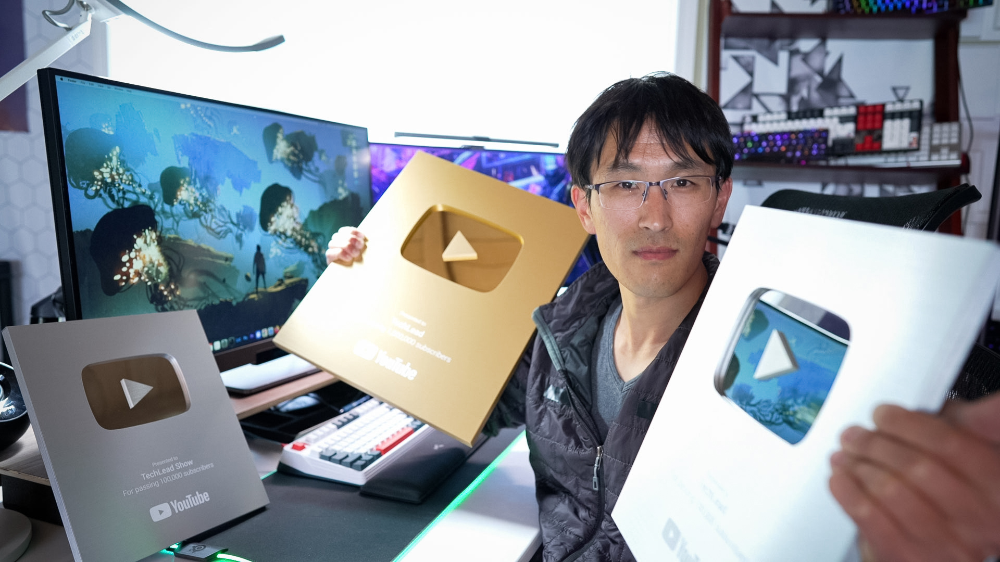

Hi, I'm Patrick Shyu. Welcome to my personal homepage. Here's a little bit about me.

## About
I'm a software engineer, entrepreneur, and content creator. With 1+ million subscribers on [YouTube](https://www.youtube.com/techlead), I create videos about tech, finance, and lifestyle. I share education and insights, while inspiring with entertainment and humor.

<iframe width="560" height="315" src="https://www.youtube.com/embed/Ap2uWsJV25w?si=C78pPblWae0poNwH" title="YouTube video player" frameborder="0" allow="accelerometer; autoplay; clipboard-write; encrypted-media; gyroscope; picture-in-picture; web-share" referrerpolicy="strict-origin-when-cross-origin" allowfullscreen></iframe>

I began my coding journey in elementary school self-learning QBasic and Visual Basic to create small games. Graduating from UC Berkeley with high honors, I majored in Computer Science (EECS) including a 1-year study-abroad program in Japan my senior year at the Tokyo Institute of Technology that would be life-changing. Upon return, I attended UC San Diego for my Master's Degree in Computer Science (emphasis in Computer Graphics), while also placing in the ACM programming competitions. I worked internships at Microsoft, Juniper Networks, and Sun Microsystems with my highlight meeting Bill Gates at his house in Seattle. During university, I also launched numerous pet projects on campus such as social media apps, schedule organizers, and event websites that would be used by thousands of students coded in self-taught Perl/CGI.

After university, my first job was at Sony Pictures in Los Angeles in 2007, working on 3D special effects for Hollywood films where I coded in C++, Python, and OpenGL. Despite an entry-level salary, in retrospect, this remains one of the best jobs throughout my career.

On weekends and evenings, I independently built apps and games on Facebook platform that went viral to millions of users while teaching myself PHP, MySQL, and JavaScript. At the time, few people understood what an app was and most people did not grasp the concept of making money online. After much hesitation, I finally quit my job, spontaneously booked a flight to London, and went full-time on my app reaching 2 million users while working out of Starbucks cafes and Apple stores for the fast WiFi. Within a year, I had become a millionaire. In total, I built around 50 apps, most failing but some that would reach millions of users scaled across 10 high-end web servers & databases that I manually managed. Modern autoscaling technologies weren't available at the time, so it was a stressful time keeping servers online in the middle of the night.

Having achieved financial success early on, I realized it would be a waste if I were to save it all for a typical old-age retirement. I wanted to maximize the combination of 4 factors I identified: health, wealth, time, and youth/vitality. My interest in travel and intentional lifestyle design would begin here.

After the Facebook apps era faded, I grew bored and eventually returned to the office, working at various startup jobs including Groupon where I coded in Ruby on Rails. This job did not last long and I soon quit that out of boredom too.

By 2013, on a whim I relocated to New York to teach myself investing and trading. I needed to learn finance. However, while renting a luxurious apartment as if an ivory tower, I realized how isolating luxury can be and left to begin what would become a journey into minimalism, embracing experiences over materialism. I traveled the European backpacker route staying in hostels on a month-long journey through the Swiss Alps, the French Riviera, and Southern Spain. I became interested in DSLR photography and timelapse videos, starting my first YouTube channel [Blue Eden](https://www.youtube.com/blueedenhd), a travel photography channel with 1.5m views. This was a lot at the time, gaining sailboat sponsorships and featured in popular blogs. My travels eventually took me back to Japan, where I developed a popular timelapse/photography desktop software application gaining 500k user sessions coded in Adobe AIR.

<iframe width="560" height="315" src="https://www.youtube.com/embed/L2HXlcgfwKc?si=wsCS30037sD1G5aI" title="YouTube video player" frameborder="0" allow="accelerometer; autoplay; clipboard-write; encrypted-media; gyroscope; picture-in-picture; web-share" referrerpolicy="strict-origin-when-cross-origin" allowfullscreen></iframe>

*Blue Eden Channel*

By 2014, I ported my old Facebook web games to the recently announced iPhone, teaching myself iOS app development. I launched about 9 apps to the App Store to 150k+ downloads.

By September 2014, I joined Google as an iOS software engineer in the YouTube team, coding primarily in Objective-C and Python. I was eventually promoted to the Tech Lead of App Architecture, helping the YouTube iOS app achieve rank #1 in the Apple App Store with 150+ million users.

By 2018, I launched the TechLead YouTube channel for fun, pioneering the tech influencer space with a blend of technical insights and comedy. At the time, few professionals took YouTube seriously.

By May 2018, I joined Meta as a staff software engineer in the Facebook Video team developing in iOS and PHP. I joined Instagram Ads briefly coding in Python, before a conflict of interest arose with my YouTube channel. I returned to my entrepreneurial endeavors.

By 2019, I finally went fulltime on YouTube. The TechLead YouTube channel covers tech, finance, and lifestyle and has achieved 150+ million views worldwide and has partnered with numerous sponsors and brands. Alongside the channel, interview training program [Tech Interview Pro](https://techinterviewpro.com/) helps software engineers pass interviews to land jobs.

Today, I remain a student of life and continue to explore the frontiers.

<iframe width="560" height="315" src="https://www.youtube.com/embed/nzyCMf0EW9A?si=saqAlqHsPEJZe62Z" title="YouTube video player" frameborder="0" allow="accelerometer; autoplay; clipboard-write; encrypted-media; gyroscope; picture-in-picture; web-share" referrerpolicy="strict-origin-when-cross-origin" allowfullscreen></iframe>

*TechLead x Blue Eden*

## Hobbies
I like my dog, traveling, gaming, photography, sailing, sci-fi, coffee, lifestyle design, and learning.

## Resume
* [Resume](https://drive.google.com/file/d/131-6ZAU0waEy7XCR9TqQY2gadglXvell/view?usp=drive_link)

## Social Media
* [TechLead on YouTube](https://www.youtube.com/techlead)
* [TechLead on Twitter / X](https://x.com/techleadhd/)
* [TechLead on Instagram](https://instagram.com/techleadhd)
* [Patrick Shyu on LinkedIn](https://www.linkedin.com/in/shyup)

